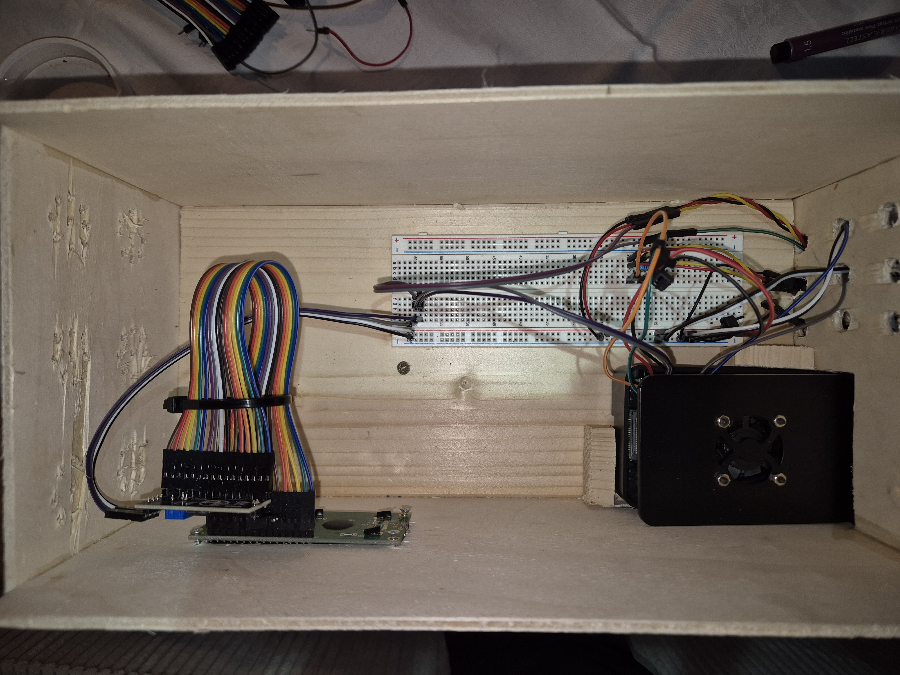
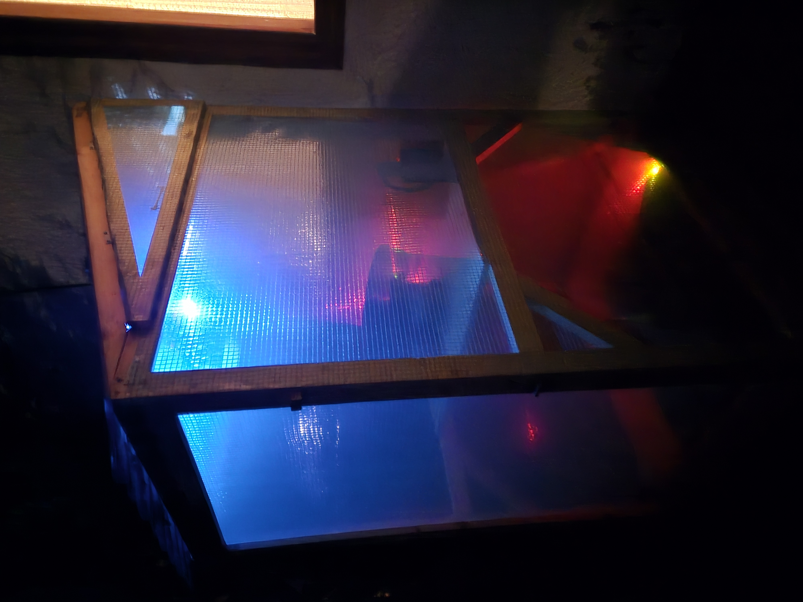

# 🧠🌱 Raspberry Pi Greenhouse Automations

This smart home automation project represents the codebase to collect physical data inside my little garden greenhouse from multiple sensors connected to a Raspberry Pi 4 — including temperature, humidity, air pressure and soil moisture.

All sensor readings are periodically collected, logged, displayed inside a little self-made box for the raspi as well as published via MQTT and stored inside an InfluxDB cloud instance. This allows both real time and historical data analysis on the measurements:

Currently, this MVP includes mainly storing & displaying sensor values to indicate if certain actions on the greenhouse are required (watering, ventilation). The idea is to build a fully automated system to minimize manual work in the greenhouse as well as implementing a full-on web application from scratch to monitor and control every sensor remotely. Adding linear actuators to automatically open & close the windows is a work in progress.

---

## 📸 Pictures & Greenhouse Informations

The greenhous is made out of wood and isolated with standard greenhouse foil to trap heat inside. It's 70cm x 90cm x ca. 160cm, while the bottom is directly connected to the surrounding soil and a second level is addable. This level serves also as an option either to add more plant pots...

...or to develop directly at a desktop inside the greenhouse!

The box at the top left position is the "house" of the rasperry and the 16x2 lcd display. Inside, a breadboard and a bunch of jumper cables ensure a stable connection between the sensors and the pi, which measures on different GPIO pins asynchronously.

Another cool feature is the lightning in the night since different leds indicate wet or dry soil moistures, and together with the display a futuristic effect is made:

---

## 🧩 Sensor Setup

- **Raspberry Pi 4 Model B**
- **1× 16c2 lcd display**
- **1× GY-BME280** barometric sensor for temperature, air humidity and air pressure
- **2× DS18B20** temperature sensors, water resistant
- **2× Soil Moisture Sensors**

