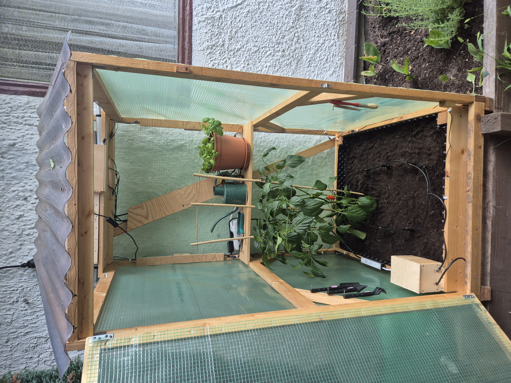
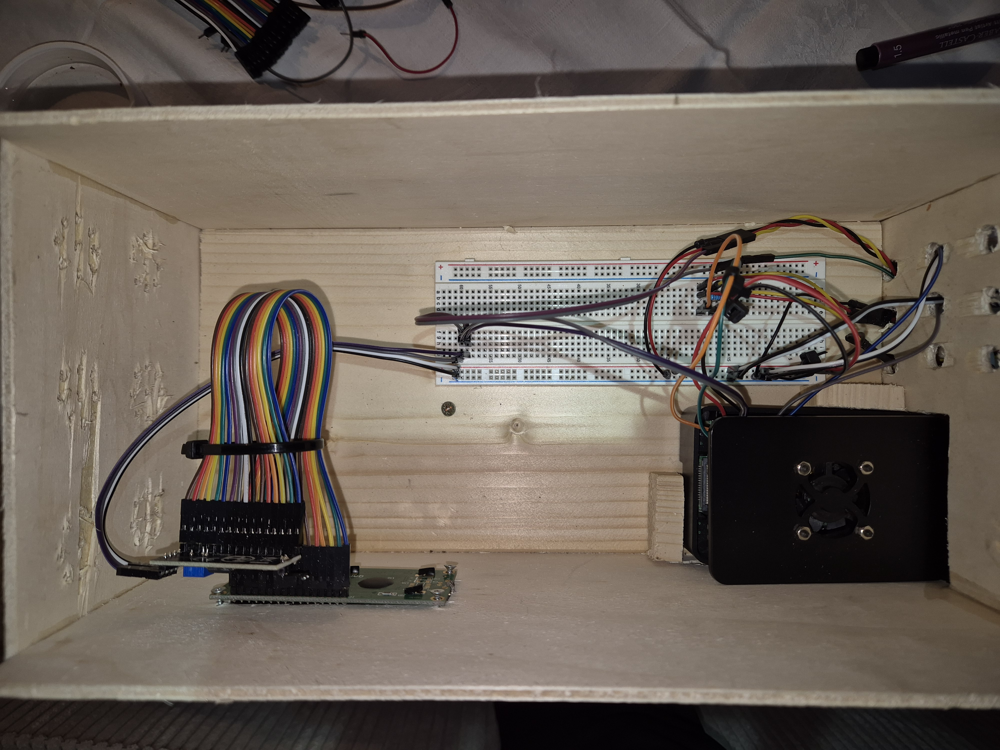
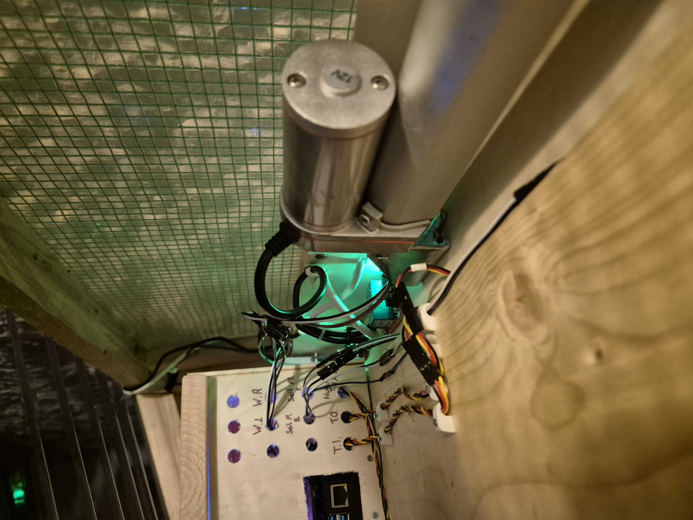

# 🧠🌱 Raspberry Pi Greenhouse Automations

This smart home automation project represents the codebase to collect physical data inside my little garden greenhouse from multiple sensors connected to a Raspberry Pi 4 — including temperature, humidity, air pressure and soil moisture. In addition, linear actuators are controllable to open and close the windows remotely via API or my custom web dashboard.

All sensor readings are periodically collected, logged, displayed inside a little self-made box for the raspi as well as stored inside an InfluxDB cloud instance. This allows both real time and historical data analysis on the measurements inside the frontend:


The window events (opening/closing) are monitor- and controllable in the "Control Center" section in the frontend. I'm also collecting the timestamps of the window calls to reproduce the last openings times. The window calls are done either manually via the dashboard or the program operator service which is responsible for automatically open/close events based on pre defined thresholds for the inside temperature.


In addition, a fastapi instance is implemented to fetch the sensor readings in a specific timeframe from the InfluxDB as well as opening and closing of the windows.


The idea is to build a fully automated system to minimize manual work by automation of ventilation and watering in the greenhouse as well as implementing a full-on web application from scratch to monitor and control every sensor remotely.

---

## 📸 Pictures & Greenhouse Information

The greenhous is made out of wood and isolated with standard greenhouse foil to trap heat inside. It's 70cm x 90cm x ca. 160cm, while the bottom is directly connected to the surrounding soil and a second level is addable. This level serves also as an option either to add more plant pots...

<p align="center">
    
</p>

...or to develop directly at a desktop inside the greenhouse! (ssh access is activated now so not required but still cool)

<p align="center">
    
</p>

The box at the top left position is the "house" of the rasperry and the 16x2 lcd display, which displays all the measurements successively in every measure cycle. Inside, a breadboard and a bunch of jumper cables ensure a stable connection between the sensors and the pi, which measures on different GPIO pins asynchronously.

<p align="center">
    
</p>

Another cool feature is the lightning in the night since different leds indicate wet or dry soil moistures, and together with the display a futuristic effect is made:

<p align="center">
    
</p>

The windows are opened and closed by 12V linear actuators which are connected with a H-Bridge to 2-channel-relays that are controlled by the pi and via the API or via scripts.

<p align="center">
    
</p>

<p align="center">
    
</p>
---

## 🎛️ Sensor Setup & GPIO wiring

- 🧠 **Raspberry Pi 4 Model B**
- 🖥️ **1× 16c2 lcd display** with IIC/I2c interface for easy wiring:
    - 5V VCC -> 5V VCC
    - GND -> GND
    - SDA -> SDA
    - SCL -> SCL 
- 🫧 **1× GY-BME280** barometric sensor for temperature, air humidity and air pressure
    - 5V VCC -> 5V VCC
    - GND -> GND
    - SDA -> SDA
    - SCL -> SCL 
    - (Since SDA/SCL are bus pins, multiple wiring together with the display shouldn't be a problem)
- 🌡️ **2× DS18B20** temperature sensors, water resistant
    - 3V VCC -> 3V VCC
    - GND -> GND
    - DATA -> Any GPIO pin, checkout this [tutorial](https://www.circuitbasics.com/raspberry-pi-ds18b20-temperature-sensor-tutorial/)
    - (10k Ohm resistor in parallel to the sensors required)
- 🫗 **2× Soil Moisture Sensors**
    - 5V VCC -> 5V VCC
    - GND -> GND
    - DATA SM1 -> GPIO 23 (Physical 16)
    - DATA SM2 -> GPIO 24 (Physical 18)
- ⚙️ **2× Linear Actuators for Wiring** (+ 2 Double-Pole 5V Relays)
    - Actuator - -> COM2
    - Actuator + -> COM1
    - 12V DC - -> NC1 and NC2
    - 12V DC + -> NO1 and NO2
    - 5V VCC -> Relays VCC
    - Pi GND -> Relays GND
    - Actuator Right Extend Pin (GPIO 16) -> Relays (R) IN1
    - Actuator Right Retract Pin (GPIO 20) -> Relays (R) IN2
    - Actuator Left Extend Pin (GPIO 5) -> Relays (L) IN1
    - Actuator Left Retract Pin (GPIO 6) -> Relays (L) IN2


---

# 🕹️ OS setup & software resources

The pi runs on ubuntu 25.10 lts (desktop version) and Python 3.13. Other ubuntu version should also work, just select one that suites best from the [Raspberry Pi Imager](https://www.raspberrypi.com/software/). The OS setup for the sensors (i2cdetect, config.txt lines, modules etc.) are readable in the specific documentations.

The repository contains poetry for dependency management and docker/docker-compose to run the application inside a container on the pi. The models and settings are wrapped by pydantic models and the envrionment variables are set either inside the docker files or (for sensitive informations like the influxdb connection details) inside an .env file. For local development, I use vscode and a virtual environment managed with poetry.

The data pipeline starts at the sensors, whereas the sensor_reader container is responsible for reading the data from the hardware, writing them into the InfluxDB and displaying the values frequently on the display inside the greenhouse. In addition, a lightweight SQLite DB is running on the pi to log the opening/closing events of the windows. The API is then structured to query the databases and provides endpoints to call on the windows or fetch data series, while big requests (>1 day, minute interval) are aggregated to ensure smooth and fast returns.

<p align="center">
    
</p>

## 🔛 (Virtual) environment setup

The following setup is suited to develop directly on the pi, this is why allowing ssh access or the ubuntu desktop version is recommended.

After checking out this repository, navigate to the root folder (/gewaechshaus) and run

```python -m venv .venv```

This creates a .venv folder containing the python virtual environment which can by activated by running

```source .venv/bin/activate```

on ubuntu. Next, every dependency defined in this repo can be directly installed and managed via poetry. For that, install poetry according to the [documentation](https://www.digitalocean.com/community/tutorials/how-to-install-poetry-to-manage-python-dependencies-on-ubuntu-22-04) and simply run

```poetry install```

This will install all dependencies necessary for this project into your venv.

To secretly store your influxDB properties as well as the environment variables for the actuator pins, create an .env file in your root folder containing following environment variables (insert your values from InfluxDB cloud):

```
INFLUXDB_HOST=<YOUR_HOST>
INFLUXDB_ORG=<YOUR_ORGANISATION_NAME>
INFLUXDB_BUCKET=<YOUR_BUCKET_NAME>
INFLUXDB_TOKEN=<YOUR_TOKEN>

WINDOW_ACTUATOR_LEFT_EXTEND_PIN=<GPIO_PIN_LEFT_EXTEND>
WINDOW_ACTUATOR_LEFT_RETRACT_PIN=<GPIO_PIN_LEFT_RETRACT>
WINDOW_ACTUATOR_RIGHT_EXTEND_PIN=<GPIO_PIN_RIGHT_EXTEND>
WINDOW_ACTUATOR_RIGHT_RETRACT_PIN=<GPIO_PIN_RIGHT_RETRACT>
WINDOW_MOVING_TIME=<HOW_LONG_ACTUATOR_TAKES>
```

The docker-compose will load these environment variables while building the image.


