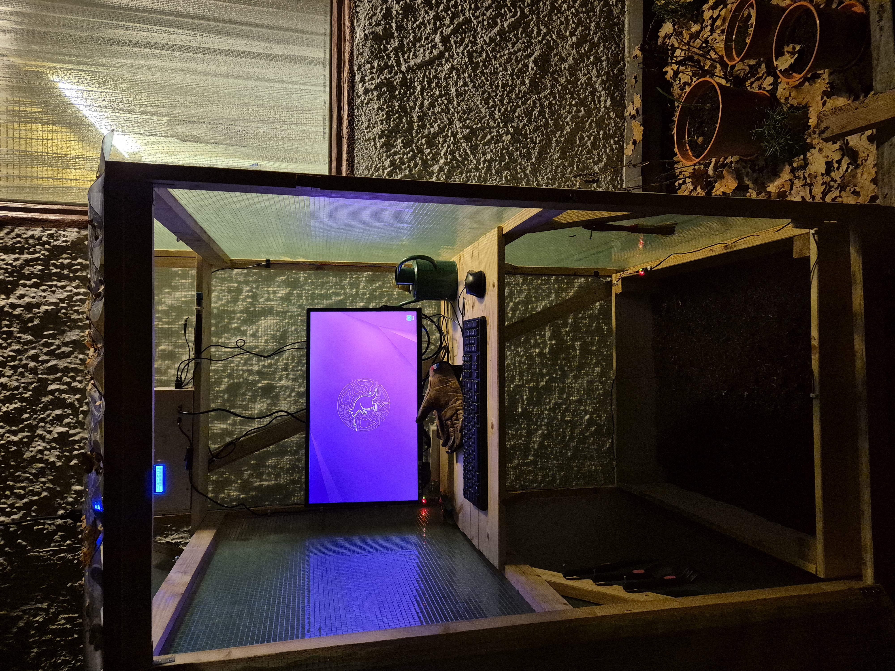
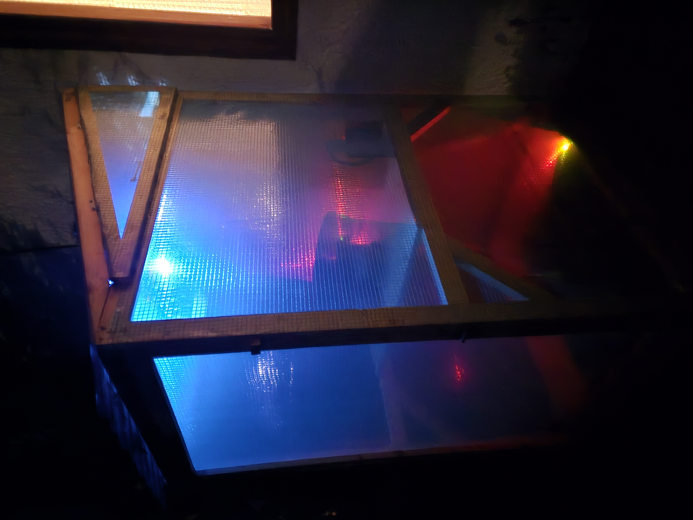
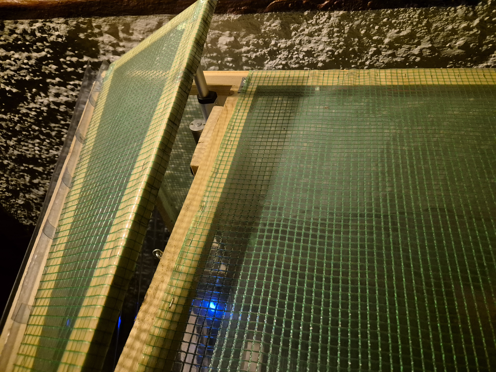
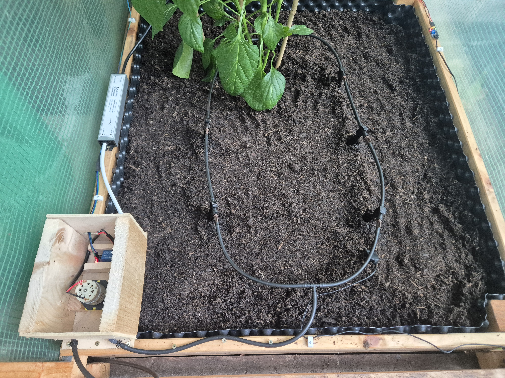
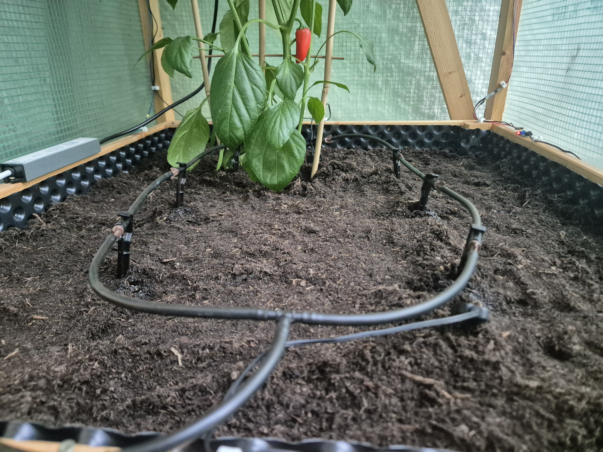
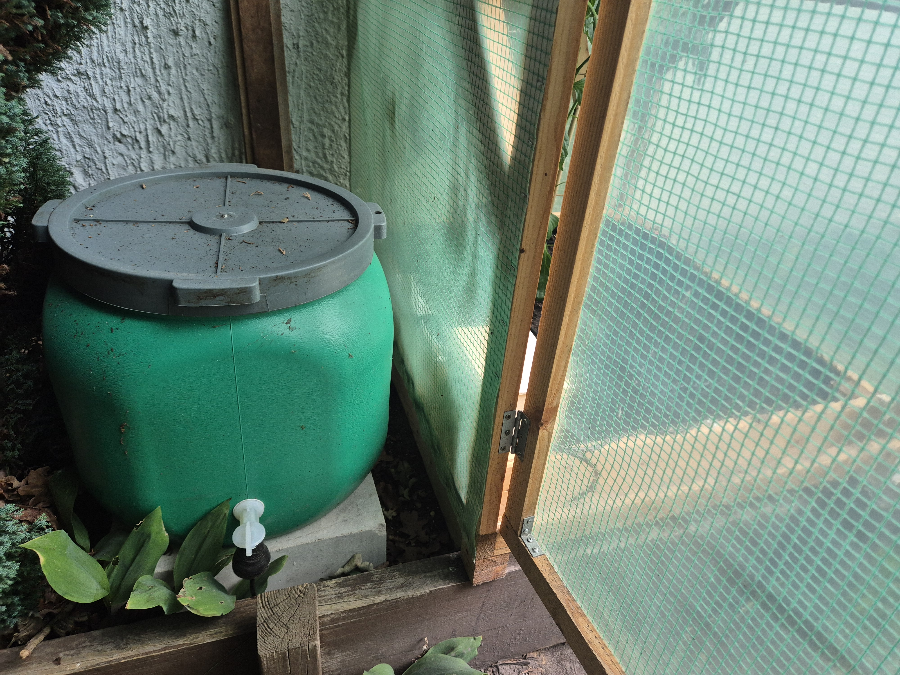
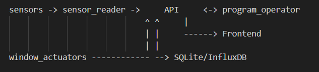

# 🧠🌱 Raspberry Pi Greenhouse Automations

This project implements a fully automated Raspberry Pi–powered greenhouse control system.
It collects environmental sensor data (temperature, humidity, air pressure, and soil moisture), stores and visualizes telemetry, automatically controls ventilation using linear actuators and irrigation with peristaltic pump — all accessible via a custom web dashboard and API.

All sensor readings are periodically collected, logged, displayed inside a little self-made box for the raspi as well as stored inside an InfluxDB cloud instance. This allows both real time and historical data analysis on the measurements inside the frontend:

### Monitoring Dashboards


### Control Centers
The window events (opening/closing) are monitor- and controllable in the "Window Control Center" section in the frontend. I'm also collecting the timestamps of the window calls to reproduce the last openings times. The window calls are done either manually via the dashboard or the program operator service which is responsible for automatically open/close events based on pre defined thresholds for the inside temperature.


Similar to the Window Control Center, the Watering Control Center provides an overview about the active peristaltic pump times that controls an automated irrigation system in the greenhouse. Calling this endpoint from the frontend as well as more insights about historic watering/window events is in progress.


### API Interface
In addition, a fastapi instance is implemented to fetch the sensor readings in a specific timeframe from the InfluxDB, opening and closing of the windows and starting watering processes.


The idea is to build a fully automated system to minimize manual work by automation of ventilation and watering in the greenhouse as well as implementing a full-on web application from scratch to monitor and control every sensor remotely.

---

## 🛠 Tech Stack

- Python (asyncio, FastAPI)
- Raspberry Pi GPIO
- InfluxDB Cloud
- React + Vite
- Docker & Docker Compose
- Netdata monitoring
- Tailscale VPN

## 🔛 (Virtual) environment setup

The following setup is suited to develop directly on the pi, this is why allowing ssh access or the ubuntu desktop version is recommended.

After checking out this repository, navigate to the root folder (/gewaechshaus) and run

```python -m venv .venv```

This creates a .venv folder containing the python virtual environment which can by activated by running

```source .venv/bin/activate```

on ubuntu. Next, every dependency defined in this repo can be directly installed and managed via poetry. For that, install poetry according to the [documentation](https://www.digitalocean.com/community/tutorials/how-to-install-poetry-to-manage-python-dependencies-on-ubuntu-22-04) and simply run

```poetry install```

This will install all dependencies necessary for this project into your venv.

To secretly store your influxDB properties as well as the environment variables for the actuator pins, create an .env file in your root folder containing following environment variables (insert your values from InfluxDB cloud):

```
LCD_COLUMNS=16

INFLUXDB_HOST=<YOUR_HOST>
INFLUXDB_ORG=<YOUR_ORGANISATION_NAME>
INFLUXDB_BUCKET=<YOUR_BUCKET_NAME>
INFLUXDB_TOKEN=<YOUR_TOKEN>

SQLITE_DB_NAME=<LOCAL_SQLITE_DB_PATH>
SQLITE_ACTUATOR_EVENTS_TABLE=window_status
SQLITE_WATERING_EVENTS_TABLE=watering
SQLITE_WINDOW_ENTITY_TABLE=window

WINDOW_ACTUATOR_LEFT_EXTEND_PIN=<GPIO_PIN_LEFT_EXTEND>
WINDOW_ACTUATOR_LEFT_RETRACT_PIN=<GPIO_PIN_LEFT_RETRACT>
WINDOW_ACTUATOR_RIGHT_EXTEND_PIN=<GPIO_PIN_RIGHT_EXTEND>
WINDOW_ACTUATOR_RIGHT_RETRACT_PIN=<GPIO_PIN_RIGHT_RETRACT>
WINDOW_MOVING_TIME=<HOW_LONG_ACTUATOR_TAKES>

WATERING_PUMP_PIN=<GPIO_PIN_PUMP>
WATERING_TIME_SECONDS=<WATERING_DURATION>

CPU_TEMP_PATH=/sys/class/thermal/thermal_zone0/temp

FRONTEND_URL=<YOUR_LOCAL_FRONTEND_URL>
VITE_API_BASE_URL=<BASE_API_FOR_FRONTEND>
```

Additional environment variables are in the settings of each service, I'm using the default values of those that are not listed here.

The docker-compose will load these environment variables while building the image. To start it, navigate to the repo root and run ```docker compose up -d --build```. Docker will create 6 images and start their corresponding containers:

- ```gewaechshaus-program-operator```: The cron worker that fetches the temperature from inside the greenhouse in a given interval (15 minutes) and operates on windows if certain thresholds are crossed. Another cron job is responsible to call watering every morning and evening to keep soil moist. Source code in ```src/services/program_operator```.
- ```gewaechshaus-api```: The uvicorn fastapi instance with endpoints to fetch data and call windows/irrigation. Source code in ```src/services/api```.
- ```gewaechshaus-sensor-reader```: The sensor reader to read GPIO singals from sensors, writes measurement into InfluxDB and displays values on lcd display. Source code in ```src/services/sensor_reader```.
- ```gewaechshaus-frontend```: React frontend for web dashboard. Source code in ```frontend/gewaechshaus```.
- ```sqlite-web```: UI for lightweight SQLite database on the pi.

## 📸 Pictures & Greenhouse Information

The greenhouse is made of wood and isolated with standard greenhouse foil to trap heat inside. 

<p align="center">
    
</p>

It's 70cm x 90cm x ca. 160cm, while the bottom is directly connected to the surrounding soil and a second level is addable. This level serves also as an option either to add more plant pots or to develop directly at a desktop inside the greenhouse! (ssh access is activated now so not required but still cool)

<p align="center">
    
</p>

The box at the top left position is the "house" of the Raspberry and the 16x2 lcd display, which displays all the measurements successively in every measure cycle. Inside, a breadboard and a bunch of jumper cables ensure a stable connection between the sensors and the pi, which measures on different GPIO pins asynchronously.

<p align="center">
    
</p>

Another cool feature is the lightning in the night since different leds indicate wet or dry soil moistures, and together with the display a futuristic effect is made:

<p align="center">
    
</p>

The windows are opened and closed by 12V linear actuators which are connected with a H-Bridge to 2-channel-relays that are controlled by the pi and via the API or via scripts.

<p align="center">
    
</p>

<p align="center">
    
</p>

The peristaltic pump is attached in the box at the front left corner of the bottom box and is also controlled by a 12V relay circuit. When running, it pumps water from a rain barrel outside the greenhouse into a irrigation ring to distribute the water in the soil evenly.

<p align="center">
    
</p>

<p align="center">
    
</p>

<p align="center">
    
</p>

---

## 🎛️ Sensor Setup & GPIO wiring

> ⚠️ Note: The sensor wiring is customized for this greenhouse setup.  
> The software can run without hardware, but sensor_reader requires GPIO-connected devices.

- 🧠 **Raspberry Pi 4 Model B**
- 🖥️ **1× 16c2 lcd display** with IIC/I2c interface for easy wiring:
    - 5V VCC -> 5V VCC
    - GND -> GND
    - SDA -> SDA
    - SCL -> SCL 
- 🫧 **1× GY-BME280** barometric sensor for temperature, air humidity and air pressure
    - 5V VCC -> 5V VCC
    - GND -> GND
    - SDA -> SDA
    - SCL -> SCL 
    - (Since SDA/SCL are bus pins, multiple wiring together with the display shouldn't be a problem)
- 🌡️ **2× DS18B20** temperature sensors, water resistant
    - 3V VCC -> 3V VCC
    - GND -> GND
    - DATA -> Any GPIO pin, checkout this [tutorial](https://www.circuitbasics.com/raspberry-pi-ds18b20-temperature-sensor-tutorial/)
    - (10k Ohm resistor in parallel to the sensors required)
- 🫗 **2× Soil Moisture Sensors**
    - 5V VCC -> 5V VCC
    - GND -> GND
    - DATA SM1 -> GPIO 23 (Physical 16)
    - DATA SM2 -> GPIO 24 (Physical 18)
- ⚙️ **2× Linear Actuators for Windows** (+ 2 Double-Pole 5V Relays)
    - Actuator - -> COM2
    - Actuator + -> COM1
    - 12V DC - -> NC1 and NC2
    - 12V DC + -> NO1 and NO2
    - 5V VCC -> Relays VCC
    - Pi GND -> Relays GND
    - Actuator Right Extend Pin (GPIO 16) -> Relays (R) IN1
    - Actuator Right Retract Pin (GPIO 20) -> Relays (R) IN2
    - Actuator Left Extend Pin (GPIO 5) -> Relays (L) IN1
    - Actuator Left Retract Pin (GPIO 6) -> Relays (L) IN2
- 💧 **Linear Actuator for Peristaltic Pump**
    - Watering Pin (GPIO 21) -> Relay IN
    - 5V VCC -> Relays VCC
    - Pi GND -> Relays GND
    - 12V DC - -> NC and NO
    - 12V GND -> COM


---

# 🕹️ OS setup & software resources

The pi runs on ubuntu 25.10 lts (desktop version) and Python 3.13. Other ubuntu version should also work, just select one that suites best from the [Raspberry Pi Imager](https://www.raspberrypi.com/software/). The OS setup for the sensors (i2cdetect, config.txt lines, modules etc.) are readable in the specific documentations.

The repository contains poetry for dependency management and docker/docker-compose to run the application inside a container on the pi. The models and settings are wrapped by pydantic models and the environment variables are set either inside the docker files or (for sensitive informations like the influxdb connection details) inside an .env file. For local development, I use vscode and a virtual environment managed with poetry.

The data pipeline starts at the sensors, whereas the sensor_reader container is responsible for reading the data from the hardware, writing them into the InfluxDB and displaying the values frequently on the display inside the greenhouse. In addition, a lightweight SQLite DB is running on the pi to log the opening/closing events of the windows. The API is then structured to query the databases and provides endpoints to call on the windows or fetch data series, while big requests (>1 day, minute interval) are aggregated to ensure smooth and fast returns. The API is called from the frontend or by the program operator, which runs an asynchronous worker every 15 minutes to fetch the latest temperature inside datapoints and act on the window endpoints if required (thresholds defined as environment variables) or to run a watering session at scheduled times (morning and evening, also controllable via environment variables).

<p align="center">
    
</p>

## ✨ Features

- 🌡 Real-time environmental monitoring
- 📈 Historical telemetry & dashboards
- 🪟 Automated window ventilation
- 💧 Controlled irrigation system
- 🌱 Soil moisture monitoring
- 🌐 Remote control via web dashboard
- 🔒 Secure remote access via Tailscale VPN
- 🐳 Containerized multi-service architecture
